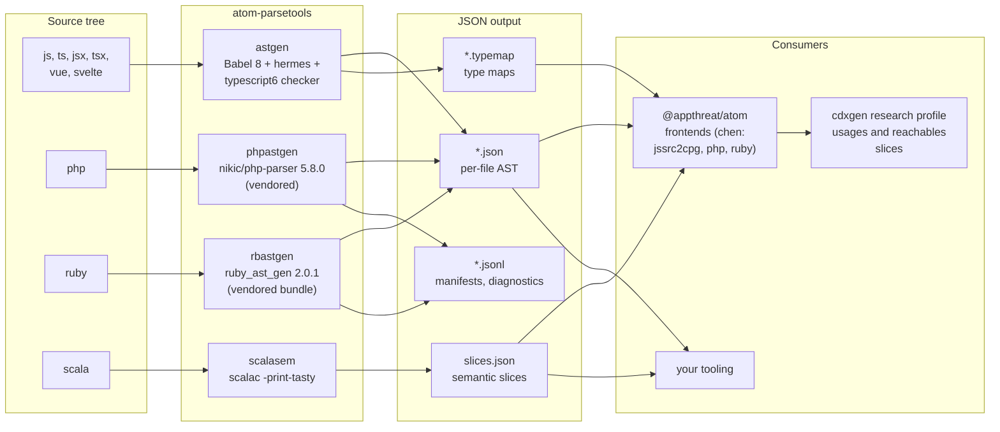

# Architecture

This page shows how the four commands relate to each other, to the parsers they wrap, and to the consumers that read their output. The design principle throughout: a parser behind a boring command, files in and files out, everything else pushed to build time.

## Position in the toolchain



The split is deliberate. Atom frontends turn trees into code property graphs; cdxgen's research profile uses those graphs to compute reachable evidence for SBOMs. Neither wants to own parser vendoring, grammar pinning, or fallback chains, so that work lives here, once, behind four commands.

## Inside a command

All four commands follow the same three-layer shape.

```text
  +---------------------------------------------------+
  |  bin wrapper (Node or Bun)                        |
  |  parse CLI args, detect runtimes, resolve paths   |
  +------------------------+--------------------------+
                           |
                           |  spawn / inline call
                           v
  +---------------------------------------------------+
  |  parser engine                                     |
  |  Babel / hermes / typescript6        (in-process)  |
  |  nikic/php-parser                    (php subprocess)
  |  ruby_ast_gen + prism or parser      (ruby subprocess)
  |  scalac -print-tasty                 (scalac subprocess)
  +------------------------+--------------------------+
                           |
                           v
  +---------------------------------------------------+
  |  output writer                                     |
  |  one .json per file, .typemap for types,          |
  |  .jsonl manifest and diagnostics                   |
  +---------------------------------------------------+
```

The wrapper layer is where the environment variables live: runtime detection (`ATOM_RUBY_HOME`, `PHP_CMD`, `SCALAC_CMD`), overrides for unreleased engines (`RUBY_ASTGEN_BIN`, `PHP_PARSER_BIN`), timeouts, and working directory. The engine layer is wrapped, never linked: PHP parsing shells out to the vendored `php-parse` under `php`, Ruby parsing shells out to the vendored gem, and only the JavaScript stack runs in-process, because it is JavaScript.

That choice has consequences worth knowing. Shelling out isolates each parse behind a process boundary, so a crashing engine cannot take the wrapper down, and the worker pool is just a bounded set of subprocesses (10 by default in both batch tools). Running Babel in-process is what makes astgen's per-file cost small enough that its pipeline is a file loop with a `gc()` every `ASTGEN_CONCURRENCY` files.

## The version fingerprint contract

`astgen --version` prints the AST format version. Consumers such as chen's `jssrc2cpg` fold that string into their parse-cache fingerprint: same version, reuse the cached parse; different version, reparse. The contract cuts both ways, and both ways are enforced in code review:

1. Whenever the emitted AST or type-map shape changes, the version must be bumped. Otherwise stale cached parses from an older astgen are silently reused.
2. Whenever the shape does not change, the version must not be bumped. Otherwise every consumer's cache invalidates for nothing.

The same idea appears as provenance fields in the other tools: phpastgen and rbastgen record `parser_backend` and versions in the manifest and, for Ruby, in every per-file record, because the backend genuinely varies with the machine.

## Discovery as a shared concern

What counts as a source file is decided per tool, but with one philosophy: match what a real project contains, not what a spec says it should. astgen accepts `vue`, `svelte`, `xsjs`, and `ejs` alongside the standard extensions and excludes tests by default. phpastgen sniffs extensionless files for `<?php`. rbastgen matches `Rakefile`, `Gemfile`, and `.rake` by basename. scalasem starts from what the compiler actually produced (`.tasty`), falling back to compiling the project.

## Where packaging happens

The `plugins/` directory is produced by `build.sh` at release time and ships inside the npm tarball: the Composer-installed PHP parser and the pure-Ruby gem bundle. It is gitignored, so a checkout contains no vendored code until you build it. The full story, including the ABI independence trick and the release checks, is in [Packaging](PACKAGING.md).
