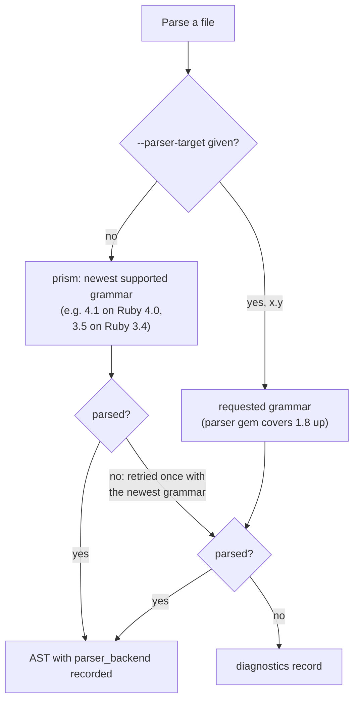

# Lesson 7: Ruby grammar backends

## Learning Objective

Understand the two Ruby parsing backends (prism and the parser gem), why the available grammar ceiling depends on the machine, and how to pin a grammar for legacy code or reproducibility.

## Pre-requisites

```text
Ruby 3.4.x or 4.0.x on the PATH (or ATOM_RUBY_HOME)
atom-parsetools installed
```

## Two backends, one bundle

The vendored generator can parse through two engines. When `prism` is available, the newest grammar its translation layer supports is used, so a Ruby 3.4 runtime parses Ruby 4.0 and 4.1 syntax. The vendored `parser` gem is the other engine, and it reaches back as far as 1.8 syntax. Which one runs is a machine property, which is why every output file records `parser_backend`.



The retry rule matters for pinned runs: a file that fails under the selected grammar gets one more attempt with the newest grammar before being counted as failed, so a single exotic file cannot sink a legacy-code scan.

## The ceiling follows the runtime

`prism` is deliberately not vendored: it carries a C extension, and the package ships pure Ruby only, so one build serves every supported Ruby. The consequence is that the newest grammar available follows the interpreter's own prism. At the time of writing, Ruby 3.4 tops out at grammar 3.5 and Ruby 4.0 at 4.1. Installing a newer `prism` gem on the machine raises the ceiling, because the caller's `GEM_PATH` is preserved and machine gems win over the bundle.

See where your machine stands:

```shell
rbastgen --parser-info
```

The `Prism gem` line names the version actually loaded. If two machines produce different results on the same file, compare `parser_backend` and the prism version before suspecting the code.

## Pinning a grammar

Parse the same modern file with a pinned older grammar and with the default:

```shell
mkdir -p backend-demo && cd backend-demo

cat > modern.rb << 'EOF'
# endless method (Ruby 3.0+)
def square(x) = x * x

number = 42
message = "value: #{number}"
puts message
EOF

rbastgen -i . -o pinned-27 --parser-target 2.7
rbastgen -i . -o newest
```

Both runs parse the file (the endless method fails under the 2.7 grammar and succeeds on the retry with the newest). Compare provenance:

```shell
python3 -c "
import json
for run in ('pinned-27', 'newest'):
    d = json.load(open(f'{run}/modern.rb.json'))
    print(run, '->', d.get('parser_backend'), d.get('ruby_version'))
"
```

When to pin: a codebase frozen on an old Ruby where newer grammar interpretations change the tree, or output that must be comparable across machines. When not to pin: everything else, since the default maximizes the syntax that parses.

## Going further back than the runtime

Because the parser gem covers 1.8 syntax, `--parser-target 1.9` works on a Ruby 4.0 machine: the grammar is a property of the engine, not the interpreter. That combination, a modern runtime parsing truly legacy grammar, is how tooling can process an old application without installing the Ruby it was written for.

## Where to go next

[Lesson 8](LESSON8.md) covers the fourth tool, scalasem, which takes a completely different route to semantics: reading the compiler's own output instead of parsing source.
