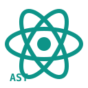

# atom-parsetools

> AST and semantics generators for JavaScript, TypeScript, PHP, Ruby, and Scala, built to feed the atom analysis pipeline.

[Get Started](README.md) · [astgen](ASTGEN.md) · [phpastgen](PHPASTGEN.md) · [rbastgen](RBASTGEN.md) · [scalasem](SCALASEM.md)

Turn source trees into **AST JSON**, **TypeScript type maps**, and **semantic slices** with a set of small, dependency-light commands that run on Node.js and Bun, then consume the output from [@appthreat/atom](https://github.com/AppThreat/atom), cdxgen, or your own tooling.

## What these tools help you do

- Parse JavaScript, TypeScript, Vue, and Svelte projects with Babel 8, Hermes, and the TypeScript 6 checker
- Batch-parse PHP 8.0 through 8.5 with a vendored nikic/php-parser, no Composer install required
- Generate Ruby ASTs from a vendored, pure-Ruby bundle that runs on Ruby 3.4 and 4.0
- Extract semantic slices and Play routes from Scala projects through the TASTy printer

## Choose your path

### New to the package

- Install and run your first command with [Getting Started](GETTING_STARTED.md)
- Learn the JSON shapes every tool emits in [Output Formats](OUTPUT_FORMATS.md)

### Tool users

- [astgen](ASTGEN.md) for JavaScript, TypeScript, Vue, and Svelte
- [phpastgen](PHPASTGEN.md) for PHP
- [rbastgen](RBASTGEN.md) for Ruby
- [scalasem](SCALASEM.md) for Scala
- Every knob in [Environment Variables](ENV.md)

### Integrators and contributors

- See where the output goes in [Architecture](ARCHITECTURE.md)
- Tune large repositories with [Performance](PERFORMANCE.md)
- Build, pack, and verify a release with [Packaging](PACKAGING.md)
- Work through the [Tutorials](LESSON1.md), ten hands-on lessons from first AST to release verification
